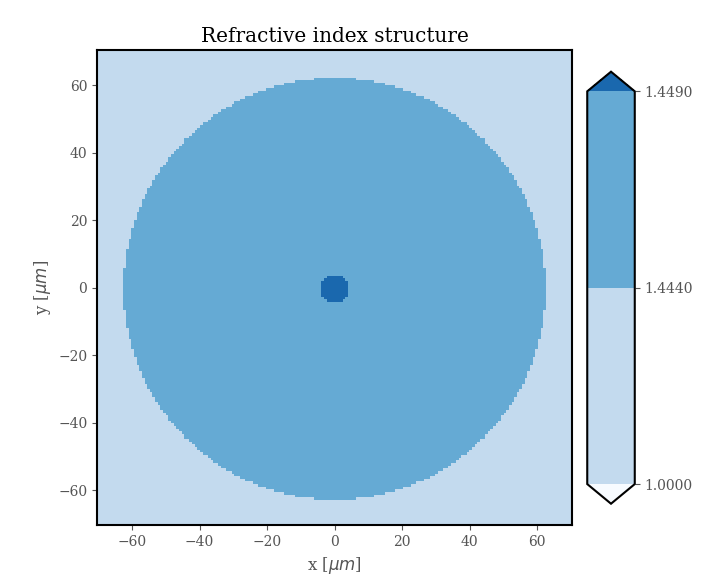

.. DO NOT EDIT.
.. THIS FILE WAS AUTOMATICALLY GENERATED BY SPHINX-GALLERY.
.. TO MAKE CHANGES, EDIT THE SOURCE PYTHON FILE:
.. "ExamplesGallery/Example1.py"
.. LINE NUMBERS ARE GIVEN BELOW.

.. only:: html

    .. note::
        :class: sphx-glr-download-link-note

        Click :ref:`here <sphx_glr_download_ExamplesGallery_Example1.py>`
        to download the full example code

.. rst-class:: sphx-glr-example-title

.. _sphx_glr_ExamplesGallery_Example1.py:

1x1 Coupler
===========

.. GENERATED FROM PYTHON SOURCE LINES 9-32

.. code-block:: default
   :lineno-start: 12

    from FiberFusing      import Geometry, Circle, BackGround
    from SuPyMode.Solver  import SuPySolver
    from PyOptik          import ExpData

    Wavelength = 1.55e-6
    Index = ExpData('FusedSilica').GetRI(Wavelength)

    Air = BackGround(Index=1) 

    Clad = Circle( Center=(0,0), Radius = 62.5, Index = Index)

    Core = Circle( Center=Clad.Center, Radius = 4.1, Index = Index+0.005 )

    Geo = Geometry(Objects = [Air, Clad, Core],
                   Xbound  = [-70, 70],
                   Ybound  = [-70, 70],
                   Nx      = 180,
                   Ny      = 180)

    Geo.Plot().Show()

.. rst-class:: sphx-glr-timing

   **Total running time of the script:** ( 0 minutes  0.000 seconds)

.. _sphx_glr_download_ExamplesGallery_Example1.py:

.. only:: html

  .. container:: sphx-glr-footer sphx-glr-footer-example

    .. container:: sphx-glr-download sphx-glr-download-python

      :download:`Download Python source code: Example1.py <Example1.py>`

    .. container:: sphx-glr-download sphx-glr-download-jupyter

      :download:`Download Jupyter notebook: Example1.ipynb <Example1.ipynb>`

.. only:: html

 .. rst-class:: sphx-glr-signature

    `Gallery generated by Sphinx-Gallery <https://sphinx-gallery.github.io>`_
