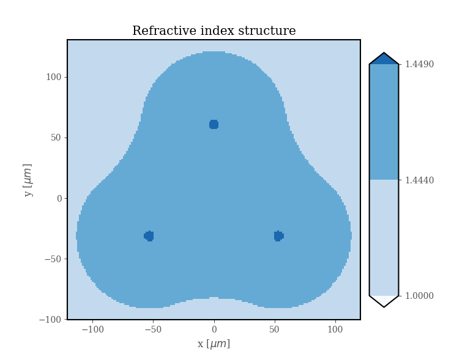

.. DO NOT EDIT.
.. THIS FILE WAS AUTOMATICALLY GENERATED BY SPHINX-GALLERY.
.. TO MAKE CHANGES, EDIT THE SOURCE PYTHON FILE:
.. "ExamplesGallery/Example3.py"
.. LINE NUMBERS ARE GIVEN BELOW.

.. only:: html

    .. note::
        :class: sphx-glr-download-link-note

        Click :ref:`here <sphx_glr_download_ExamplesGallery_Example3.py>`
        to download the full example code

.. rst-class:: sphx-glr-example-title

.. _sphx_glr_ExamplesGallery_Example3.py:

3x3 Coupler
===========

.. GENERATED FROM PYTHON SOURCE LINES 9-33

.. code-block:: default
   :lineno-start: 13

    from FiberFusing      import Geometry, Fused3, Circle, BackGround
    from SuPyMode.Solver  import SuPySolver
    from PyOptik          import ExpData

    Wavelength = 1.55e-6
    Index = ExpData('FusedSilica').GetRI(Wavelength)

    Air = BackGround(Index=1) 

    Clad = Fused3(FiberRadius = 60, Fusion = 0.3, Index = Index)

    Cores = [ Circle(Center=Core, Radius=4.1, Index=Index+0.005) for Core in Clad.Cores]

    Geo = Geometry(Objects = [Air, Clad] + Cores,
                   Xbound  = [-120, 120],
                   Ybound  = [-100, 130],
                   Nx      = 180,
                   Ny      = 180)

    Geo.Plot().Show()

.. rst-class:: sphx-glr-timing

   **Total running time of the script:** ( 0 minutes  0.000 seconds)

.. _sphx_glr_download_ExamplesGallery_Example3.py:

.. only:: html

  .. container:: sphx-glr-footer sphx-glr-footer-example

    .. container:: sphx-glr-download sphx-glr-download-python

      :download:`Download Python source code: Example3.py <Example3.py>`

    .. container:: sphx-glr-download sphx-glr-download-jupyter

      :download:`Download Jupyter notebook: Example3.ipynb <Example3.ipynb>`

.. only:: html

 .. rst-class:: sphx-glr-signature

    `Gallery generated by Sphinx-Gallery <https://sphinx-gallery.github.io>`_
