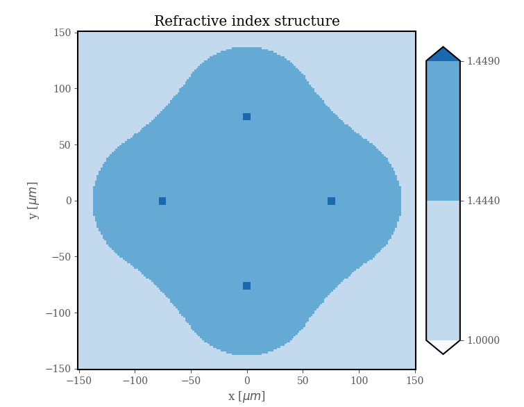

.. DO NOT EDIT.
.. THIS FILE WAS AUTOMATICALLY GENERATED BY SPHINX-GALLERY.
.. TO MAKE CHANGES, EDIT THE SOURCE PYTHON FILE:
.. "ExamplesGallery/Example4.py"
.. LINE NUMBERS ARE GIVEN BELOW.

.. only:: html

    .. note::
        :class: sphx-glr-download-link-note

        Click :ref:`here <sphx_glr_download_ExamplesGallery_Example4.py>`
        to download the full example code

.. rst-class:: sphx-glr-example-title

.. _sphx_glr_ExamplesGallery_Example4.py:

4x4 Coupler
===========

.. GENERATED FROM PYTHON SOURCE LINES 10-33

.. code-block:: default
   :lineno-start: 13

    from FiberFusing      import Geometry, Fused4, Circle, BackGround
    from SuPyMode.Solver  import SuPySolver
    from PyOptik          import ExpData

    Wavelength = 1.55e-6
    Index = ExpData('FusedSilica').GetRI(Wavelength)

    Air = BackGround(Index=1) 

    Clad = Fused4(FiberRadius = 62.5, Fusion = 0.5, Index = Index)

    Cores =  [ Circle(Center=Core, Radius=4.1, Index=Index+0.005) for Core in Clad.Cores]

    Geo = Geometry(Objects = [Air, Clad] + Cores,
                   Xbound  = [-150, 0],
                   Ybound  = [-150, 0],
                   Nx      = 80,
                   Ny      = 80)

    Geo.Plot().Show()

.. rst-class:: sphx-glr-timing

   **Total running time of the script:** ( 0 minutes  0.000 seconds)

.. _sphx_glr_download_ExamplesGallery_Example4.py:

.. only:: html

  .. container:: sphx-glr-footer sphx-glr-footer-example

    .. container:: sphx-glr-download sphx-glr-download-python

      :download:`Download Python source code: Example4.py <Example4.py>`

    .. container:: sphx-glr-download sphx-glr-download-jupyter

      :download:`Download Jupyter notebook: Example4.ipynb <Example4.ipynb>`

.. only:: html

 .. rst-class:: sphx-glr-signature

    `Gallery generated by Sphinx-Gallery <https://sphinx-gallery.github.io>`_
